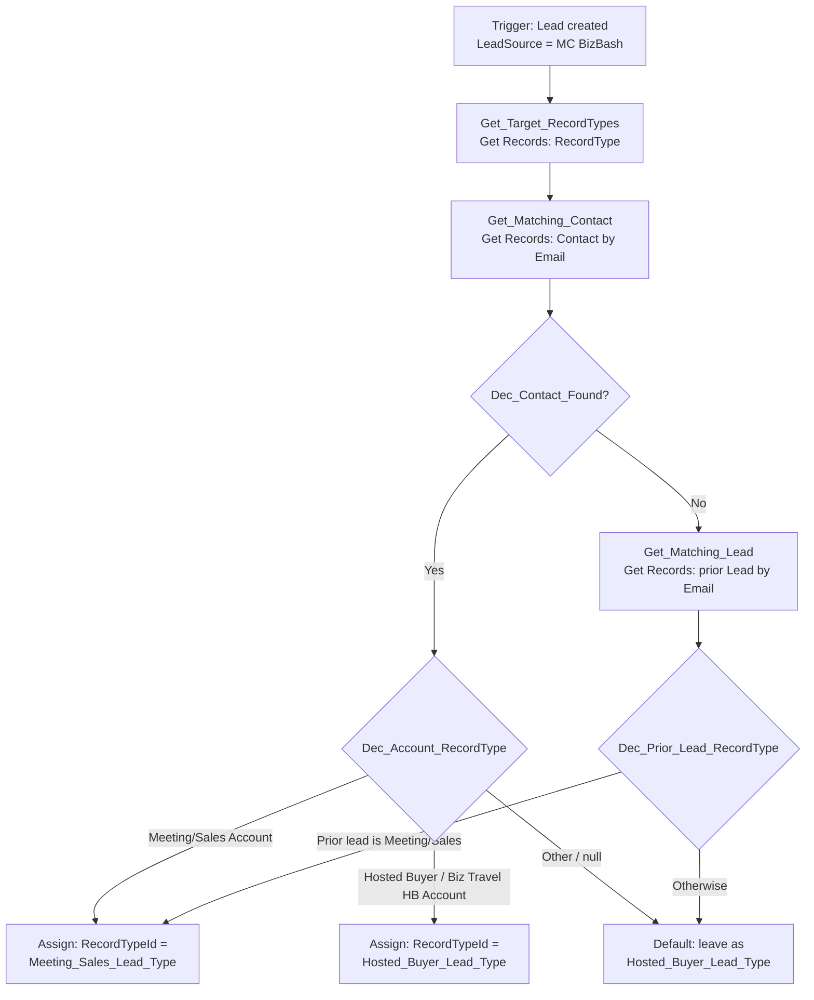

# Flow Design: MC BizBash Lead Record Type Classification

**Goal:** Leads created by the SFMC integration should be classified at insert time as **Meeting/Sales Lead Type** (supplier/sales leads → Sales team) or **Hosted Buyer Lead Type** (buyer leads → Hosted Buyer Recruitment team), based on what we already know about the person/company in Salesforce.

**Current state (verified against org, 2026-06-10):** All leads created by the MC Connect user (`0054X00000Dk173QAB`) get `Hosted_Buyer_Lead_Type` — the integration never sets `RecordTypeId`, so the profile default applies.

---

## Flow Overview

| Property | Value |
|---|---|
| Name | `MC_BizBash_Lead_RecordType_Classification` |
| Type | Record-Triggered Flow |
| Object | Lead |
| Trigger | A record is **created** |
| Optimization | **Fast Field Updates (before-save)** — no extra DML, no recursion risk |
| Run context | System context (record type assignment does NOT require the MC Connect profile to have the record type assigned) |

## Record Type Reference (queried from org)

| Object | Record Type | DeveloperName | Id |
|---|---|---|---|
| Lead | Meeting/Sales Lead Type | `Meeting_Sales_Lead_Type` | `01230000000bVYNAA2` |
| Lead | Hosted Buyer Lead Type | `Hosted_Buyer_Lead_Type` | `01230000000bVYDAA2` |
| Account | Meeting/Sales Account Record Type | `Meeting_Sales_Account_Record_Type` | `01230000000bVYXAA2` |
| Account | Hosted Buyer Account Record Type | `Hosted_Buyer_Account_Record_Type` | `01230000000bVYcAAM` |
| Account | Business Travel Hosted Buyer Account Record Type | `Business_Travel_Hosted_Buyer_Account_Record_Type` | `0121B000001lt6pQAA` |

> Best practice: in the Flow, look up RecordType Ids by `DeveloperName` (one Get Records on the RecordType object) rather than hardcoding Ids, so the Flow deploys cleanly from sandbox to production.

---

## Entry Conditions

```
Formula: OR(BEGINS({!$Record.LeadSource}, "MC "), {!$Record.CreatedById} = "0054X00000Dk173QAB")
```

Covers all SFMC integration sources two ways: any `MC <brand>` LeadSource (MC BizBash, MC Meetings, MC Travel, future sources) OR any lead created by the MC Connect bridge user. The second clause is required because some pipelines (e.g., the lead 00QUX00000RqnY92AJ created 2026-05-23) create leads with **LeadSource = null** — those pipelines should ideally be fixed to set LeadSource, but the Flow doesn't depend on it. *(Updated 2026-06-10: originally `LeadSource = 'MC BizBash'` only.)*

## Implemented Cascade (as deployed)

1. Exact email → Contact → its Account's record type (Meeting/Sales → MS; Hosted Buyer → HB; other → default)
2. Exact email → prior open Lead with Meeting/Sales record type → MS (non-MS prior leads fall through, since they may themselves be misclassified defaults)
3. **Exact company name → Account** — checked Meeting/Sales first (MS-wins precedence), then Hosted Buyer
4. No match → default Hosted Buyer

Every path stamps `Classification_Reason__c`. Email-domain matching (v2 Tier 3 below) is NOT yet implemented — it requires the `Email_Domain__c` Contact field and backfill, and beware brand-wide domains: @sheraton.com spans 217 contacts across accounts of 4 different record types.

## Flow Elements



### 1. `Get_Target_RecordTypes` — Get Records (×2, or one with In filter)

- Object: `RecordType`
- Filters: `SobjectType = 'Lead'` AND `DeveloperName = 'Meeting_Sales_Lead_Type'` → store as `varMeetingSalesLeadRT`
- Second Get (only if you also want to *explicitly* set Hosted Buyer rather than rely on default): `DeveloperName = 'Hosted_Buyer_Lead_Type'` → `varHostedBuyerLeadRT`

### 2. `Get_Matching_Contact` — Get Records

- Object: `Contact`
- Filters: `Email = {!$Record.Email}` AND `AccountId != null`
- Sort: `LastModifiedDate DESC`, **get first record only**
- Store all fields (gives access to `{!Get_Matching_Contact.Account.RecordType.DeveloperName}`)

### 3. `Dec_Contact_Found` — Decision

- **Contact found:** `{!Get_Matching_Contact}` is not null → go to `Dec_Account_RecordType`
- **No contact:** → go to `Get_Matching_Lead`

### 4. `Dec_Account_RecordType` — Decision

Evaluate `{!Get_Matching_Contact.Account.RecordType.DeveloperName}`:

| Outcome | Condition | Action |
|---|---|---|
| **Supplier / Sales** | = `Meeting_Sales_Account_Record_Type` | Assign `{!$Record.RecordTypeId}` = `{!varMeetingSalesLeadRT.Id}` |
| **Hosted Buyer** | = `Hosted_Buyer_Account_Record_Type` OR `Business_Travel_Hosted_Buyer_Account_Record_Type` | Assign Hosted Buyer Lead RT (explicit) |
| **Default (other account types: Connect, Corporate, Vendor, Advertiser, etc.)** | — | Leave as default (Hosted Buyer) — see Open Decisions |

### 5. `Get_Matching_Lead` — Get Records (no-contact branch)

- Object: `Lead`
- Filters: `Email = {!$Record.Email}` AND `Id != {!$Record.Id}` AND `IsConverted = false`
- Sort: `LastModifiedDate DESC`, get first record only

### 6. `Dec_Prior_Lead_RecordType` — Decision

- If prior lead's `RecordType.DeveloperName = 'Meeting_Sales_Lead_Type'` → assign Meeting/Sales (inherit the classification a rep already made)
- Otherwise → default (Hosted Buyer)

### 7. Assignment elements

Before-save Assignment on `{!$Record.RecordTypeId}` — committed with the original insert, zero extra DML.

**Optional audit field:** add a custom field `Classification_Reason__c` (Text, 100) and set it in each branch (`"Matched Contact → Meeting/Sales Account"`, `"Matched prior Lead RT"`, `"No match — default"`). Strongly recommended for the first few weeks so you can audit accuracy.

---

## Routing — Important Caveat

Record type alone doesn't route the lead. Two things to know:

1. **Lead Assignment Rules do NOT fire** for leads created via the MC Connect bridge (`CreateSalesforceObject` doesn't set the assignment rule header). All integration leads stay owned by the MC Connect user.
2. **Recommendation:** add a second pass to this Flow (or a separate after-save flow) that sets `OwnerId` to the appropriate **Queue**:
   - Meeting/Sales Lead Type → Sales queue
   - Hosted Buyer Lead Type → Hosted Buyer Recruitment queue
   
   Owner assignment requires an **after-save** path (or do it in the same Flow using a second, after-save trigger path). Get queue Ids via Get Records on `Group` where `Type = 'Queue'` and `DeveloperName = '<queue dev name>'`.

---

## Edge Cases & Open Decisions

1. **Same email matches multiple Contacts on different account types** — current design takes most recently modified. Alternative precedence rule: "if ANY match is Meeting/Sales → Sales." Needs a business call.
2. **No CRM match at all** — defaults to Hosted Buyer. If certain forms are inherently supplier-oriented, a *source-based* override (mapping DE / Decision on `Lead_Details__c`) could classify those as Meeting/Sales even with no match. Good Phase 2.
3. **Email-domain → Account matching** (e.g., new person at a known Meeting/Sales account) — possible Phase 2, but fuzzy; not in v1.
4. **Existing-lead updates** — the AMPscript's `UpdateSingleSalesforceObject` path only touches opt-in fields on existing leads; this Flow (Created trigger) won't re-evaluate them. Historic misclassified leads need a **backfill** (see below).
5. **Converted leads** excluded from the prior-lead match.

## Backfill (historic leads)

Since the org blocks Apex class deployment but allows Anonymous Apex, backfill with a one-off Anonymous Apex script (or Data Loader export/update): find open leads with `CreatedById = '0054X00000Dk173QAB'` whose email matches a Contact on a Meeting/Sales account, and flip `RecordTypeId` to `01230000000bVYNAA2`. Happy to draft this script.

## v2: Extended Matching — Email Domain & Company Name

Exact-email matching only catches people already in the CRM. Domain and company-name matching extend coverage to *new people at known companies* — but with lower confidence, so they run as a **cascade** (stop at first hit, highest confidence first).

### Org data (queried 2026-06-10)

| Account RT | Total | With `Website` populated |
|---|---|---|
| Meeting/Sales | 28,690 | 8,610 (30%) |
| Hosted Buyer | 15,585 | 3,984 (26%) |
| Business Travel Hosted Buyer | 0 | — (unused; dropped from logic) |

`Account.Website` is only ~30% populated, so domain matching against Website alone misses most accounts. Matching the domain against **Contact emails** gives far better coverage (every Contact has an email).

### Matching cascade (v2)

| Tier | Match | Confidence | Notes |
|---|---|---|---|
| 1 | Contact by exact email | High | v1 logic |
| 2 | Prior open Lead by exact email | High | v1 logic |
| 3 | **Email domain** → Contacts at same domain → their Account RT | Medium | Skip if free-mail domain (gmail, yahoo, hotmail, outlook, aol, icloud, etc.) |
| 4 | **Company name** → Account by exact name match | Low | Form-entered company is free text; exact match only ("IBM" ≠ "IBM Corp"). Optional. |
| 5 | No match | — | Default Hosted Buyer (or source-based override) |

### Tier 3 implementation — do NOT use a wildcard query

A naïve `Contact.Email ENDS WITH '@domain.com'` Get Records is a non-selective leading-wildcard query — slow and risky against a large Contact table inside a before-save flow. Instead:

1. **Add `Email_Domain__c` (Text 80) on Contact**, populated by a tiny before-save Flow on Contact (formula: `LOWER(MID(Email, FIND("@", Email)+1, 80))`). Backfill once via Anonymous Apex/Data Loader. Consider marking it an External ID for indexing.
2. Lead flow computes `varDomain` with the same formula from `{!$Record.Email}`.
3. Decision: skip Tier 3 if `varDomain` is in the free-mail list (formula with `CONTAINS("gmail.com|yahoo.com|hotmail.com|outlook.com|aol.com|icloud.com|...", varDomain)` — or a Custom Metadata list for maintainability).
4. Get Records: `Contact` where `Email_Domain__c = varDomain` AND `AccountId != null`, sorted `LastModifiedDate DESC`, first record → read `Account.RecordType.DeveloperName`.

(Optionally also add `Domain__c` on Account derived from `Website` as a secondary Tier-3 lookup, but at 30% fill rate it adds little over the Contact-domain match.)

### Tier 3/4 conflict handling

One domain or company name can match contacts on **both** account types (e.g., a venue that both exhibits and buys). Recommended precedence: **if any match in the domain is on a Meeting/Sales account → classify Meeting/Sales** (sales triage is the safer failure mode — a rep can requeue to HB Recruitment; implement as a second Get Records filtered to Meeting/Sales accounts first). Confirm this with both teams.

### Tier 4 caveats (company name)

- Exact equals only; SOQL is case-insensitive so "ibm" = "IBM" is fine, but punctuation/suffix variants won't match.
- Skip if `Company` is null, "self", "n/a", or a person's name (common in form data) — consider a minimum-length check.
- Expect low hit rate; its main value is catching well-known exact names. If audit shows noise, disable this tier.

### Classification_Reason__c values (v2)

`Exact email → Contact`, `Exact email → prior Lead`, `Domain match → <domain>`, `Company match → <account name>`, `No match — default`. Review weekly for the first month; tighten tiers based on accuracy.

## Deployment & Test Plan

1. Build and activate in **sandbox**; deploy via Change Set / Metadata API (Flows are deployable — the Apex restriction doesn't apply).
2. Test matrix:
   | Scenario | Expected RT |
   |---|---|
   | Email matches Contact on Meeting/Sales account | Meeting/Sales Lead Type |
   | Email matches Contact on Hosted Buyer account | Hosted Buyer Lead Type |
   | Email matches open prior Lead (Meeting/Sales RT) | Meeting/Sales Lead Type |
   | No match anywhere | Hosted Buyer Lead Type (default) |
   | Email matches Contact on "Connect"/"Corporate"/other account | Hosted Buyer (v1 default) — confirm desired |
   | (v2) New person, corporate domain matches Meeting/Sales contacts | Meeting/Sales Lead Type |
   | (v2) Gmail/free-mail address, no other match | Hosted Buyer (Tier 3 skipped) |
   | (v2) Company exactly matches a Meeting/Sales account name | Meeting/Sales Lead Type |
   | (v2) Domain matches contacts on BOTH account types | Per precedence rule (default: Meeting/Sales) |
3. End-to-end: insert a test record into the `Manual_Entries` DE, run `CRM_Integration`, verify the created Lead's record type and `Classification_Reason__c`.
4. Monitor first week via report: integration leads grouped by RecordType + Classification_Reason.
